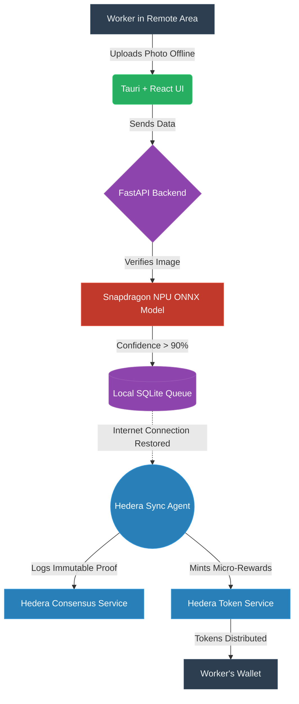

# Project Turtle 🐢

**An offline-first, AI-driven sustainability agent network integrating the Hedera DLT with Snapdragon NPU edge processing.**

Built for the Hedera Hackathon, **Project Turtle** solves the connectivity problem in ecological data collection. It empowers environmental workers (tree planters, ocean cleanup crews) in remote, offline areas to verify their ecological impact using local AI. Once connected to the internet, the autonomous agent syncs with the Hedera network to log immutable proofs and issue tokenized micro-rewards (DeFi).

### Hackathon Themes Addressed:
*   **Theme 1: AI & Agents:** An autonomous background agent manages the queue and handles Hedera interactions.
*   **Theme 2: DeFi & Tokenization:** Ecological actions are tokenized into micro-rewards upon consensus.
*   **Theme 3: Sustainability:** Incentivizes and cryptographically verifies regenerative actions.

---


## 🏗️ Architecture & Flowchart

The system operates on an offline-first paradigm. Data is verified on-device using the Snapdragon NPU, queued locally, and synced asynchronously when an internet connection is established.



---

## 🗺️ Roadmap

1.  **Phase 1: Proof of Concept (Current)**
    *   Offline Vision Verification Mockup.
    *   Local Queue Management.
    *   Hedera Sync Agent Simulation.
2.  **Phase 2: Hardware Acceleration**
    *   Full Snapdragon NPU integration via QNN Execution Provider.
    *   Optimized on-device models for diverse ecological verification.
3.  **Phase 3: Smart Contract & DeFi Integration**
    *   Live Hedera Testnet integration.
    *   Automated token issuance (HTS) based on HCS consensus.
4.  **Phase 4: Mobile Edge Deployment**
    *   Porting the React+Tauri architecture to mobile platforms (Android/iOS) for field workers.

---

## 📁 File Structure

```text
Snapdragon-hp/
├── backend/                    # Python Backend (FastAPI)
│   ├── main.py                 # Core API endpoints & server
│   └── services/
│       ├── hedera_agent.py     # Background agent syncing to Hedera (HCS/HTS)
│       └── ml_pipeline.py      # ONNX Runtime logic for NPU vision verification
├── frontend/                   # User Interface (React + Tauri)
│   ├── src/
│   │   ├── App.jsx             # Main dashboard (Offline queue, uploads)
│   │   ├── main.jsx            # React entry point
│   ├── package.json            # Frontend dependencies
├── filecore/                   # File Security Engine (Sibling module)
└── README.md                   # Project documentation
```


---

## 🚀 Setup Instructions

1.  **Start the Backend (AI & Hedera Agent):**
    ```bash
    python backend/main.py
    ```
2.  **Start the Frontend (UI):**
    ```bash
    cd frontend
    npm install
    npm run dev
    ```
